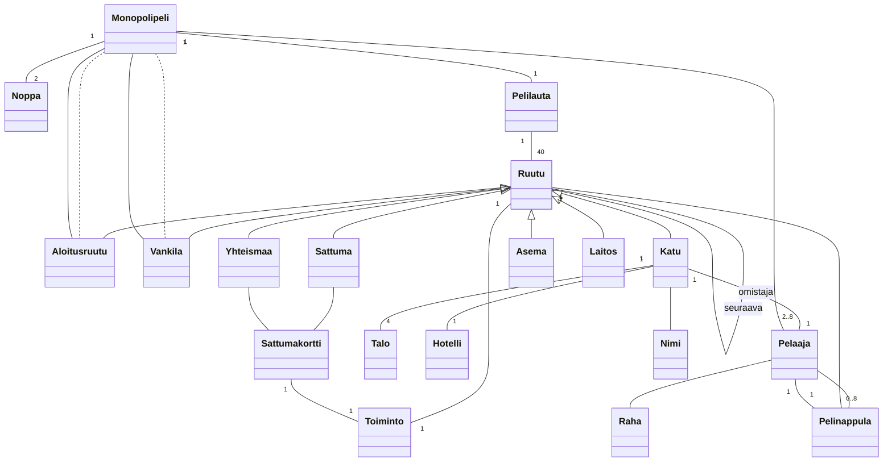

## Monopoli, alustava luokkakaavio

```mermaid
 classDiagram
    Monopolipeli "1" -- "2" Noppa
    Monopolipeli "1" -- "1" Pelilauta
    Pelilauta "1" -- "40" Ruutu
    Ruutu "1" -- "1" Toiminto
    Ruutu <|-- Aloitusruutu
    Ruutu <|-- Vankila
    Ruutu <|-- Sattuma
    Ruutu <|-- Yhteismaa
    Ruutu <|-- Katu
    Ruutu <|-- Asema
    Ruutu <|-- Laitos

    Aloitusruutu -- Monopolipeli
    Vankila -- Monopolipeli

    Sattuma -- Sattumakortti
    Yhteismaa -- Sattumakortti
    Sattumakortti "1" -- "1" Toiminto

    Katu "1" -- "4" Talo
    Katu "1" -- "1" Hotelli
    Katu "1" -- "1" Pelaaja : omistaja
    Katu -- Nimi

    Pelaaja "2..8" -- "1" Monopolipeli
    Pelaaja -- Pelinappula
    Pelaaja -- Raha

    Pelinappula "1" -- "1" Pelaaja
    Ruutu "1" -- "1" Ruutu : seuraava
    Ruutu "1" -- "0..8" Pelinappula

    Monopolipeli .. Vankila
    Monopolipeli .. Aloitusruutu
```