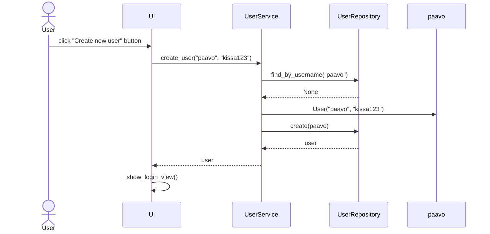

# Architecture

## Package diagram

The application's layered architecture has three main layers that are the UI layer, the Services layer and the Repositories layer. The relations between the layers are shown in the pacakge diagram. The UI components use the Services and the Services use Repositories. Each layer depends only on the layer below it.

The UI layer contains all of the user interface components. The Services layer contains the business logic and acts as a middleware between UI and data storage. The Repositories layer handles the data storage and retrieval and communicates with the database.

## User Interface

The user interface has four different views. The views are handled by separate classes in the UI layer:

- Login view (LoginView)
- Registration view (RegistrationView)
- Main page view (LoggedInView)
- Team view (TeamView)

The UI follows a single-view-at-a-time principle so only one view is visible at once. When the application is started, the Login view appears. From there the user has to first go to the Registration view from where they can create a new user and the log in. The Main page view appears after a successful login. The Main page view includes features: creating new teams, displaying user's teams as clickable buttons and logging out. When a team is clicked, the Team view opens. The Team view includes features: adding players to teams, displaying team roster, starting new games, showing game history and returning to main page.

## Main Functionalities

### Sequence diagram: creating a new user

When user inputs unused username and password and clicks "Register", the control of the application proceeds as follows:

