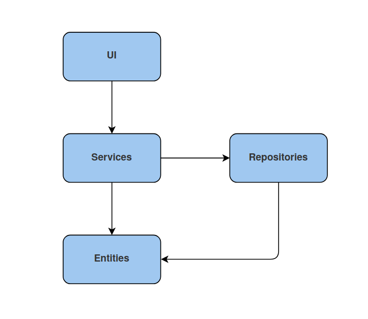
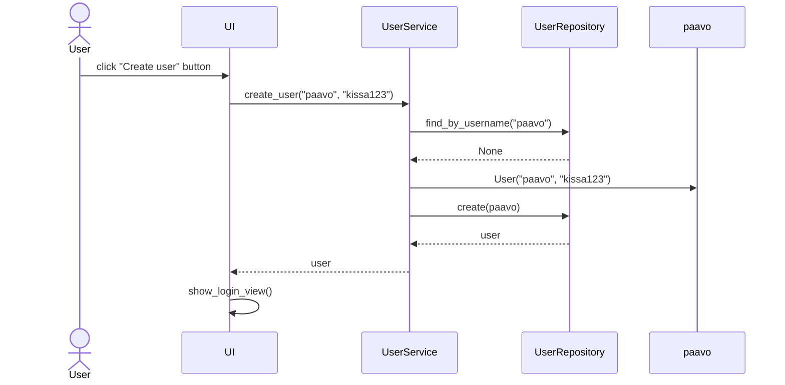

# Architecture

## Package diagram

## Sequence diagram: creating a new user

When user inputs unused username and password and clicks "Create", the control of the application proceeds as follows:

