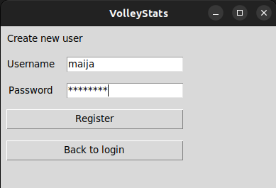
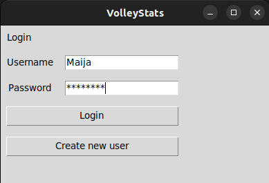
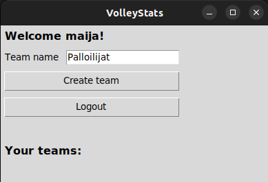
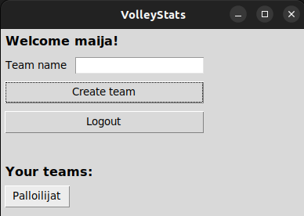
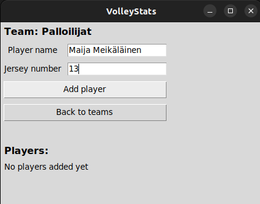
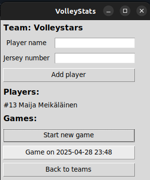

# User Guide

Check on [README](https://github.com/rautiais/ot-harjoitustyo/blob/main/README.md) how to install the app. Download the latest [release](https://github.com/rautiais/ot-harjoitustyo/releases).

## Startup instructions

Start the application with the command:

```
poetry run invoke start
```

## Using the app

### Creating a new account



## Logging in



### Adding a new team




### Adding a new player



