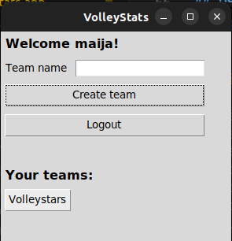

# User Guide

Check on [README](https://github.com/rautiais/ot-harjoitustyo/blob/main/README.md) how to install the app. Download the latest [release](https://github.com/rautiais/ot-harjoitustyo/releases).

## Startup instructions

Start the application with the command:

```
poetry run invoke start
```

## Using the app

### Creating a new account

To create a new account, you need to click _Create new user_ on the logging page. On the registration page, you can add credentials and then register.


### Logging in

To log in, you need to type the correct username and password and then click _Login_.


### Adding a new team

To add a new team, just type a team name that has not been used and then click _Create team_. The new team appears on the screen and then you can click the team to go to the team's page.




### Adding a new player

On the team's page, you can add a new player to the team. Add the name of the player and the jersey number and then click _Add player_ and the name of the player will appear on the screen.


### Starting a game

You can click _Start new game_ and then you get a time stamp of when the game has been started. When clicking that game's button and you get the game view where you can see the players in the game.


### Adding statistics

We added another player to the roster and started a new game. Now you can add both passing and serving scores to each player. You can see the passing and serving average statistics per player and for the whole team.


### Ending a game

After clicking _End Game_, you can't modify the scores anymore but you can still check the statistics when you click the game open again.


