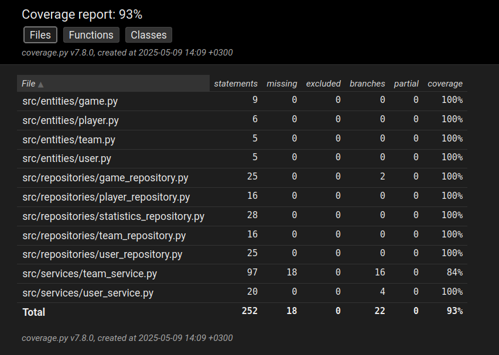

# Testing Documentation

The application has been tested with automated pytest tests which care located in the src/tests directory. The tests are divided into two directories, repositories and services, depending on what the tests are handling. The tests are intended to test the application on both the unit and integration levels. System level tests have been done by using the application by hand.

### Test Coverage - Unit and integration testing

The application's branching coverage is 93% when the ui layer and the code related to the database connection are ommitted from testing.

The database error handling in the team service is not being tested and decreases the overall test coverage.

### System testing and UI

## Installation

The application has been tested to work when the [latest release](https://github.com/rautiais/ot-harjoitustyo/releases/tag/viikko7) was cloned from the GitHub repository and set up according to the [instructions](https://github.com/rautiais/ot-harjoitustyo/blob/main/README.md). This has only been verified on Linux.

The application is not designed to make use of any prior data in the database. It is necessary to clean and set up the database prior to every execution.

## Functionalities

System testing of the application's functionalities have been done manually. All the application's functionalities (as stated in the [requirement specification](https://github.com/rautiais/ot-harjoitustyo/blob/main/volleystats-app/dokumentaatio/vaatimusmaarittely.md)) have been tested to work.
